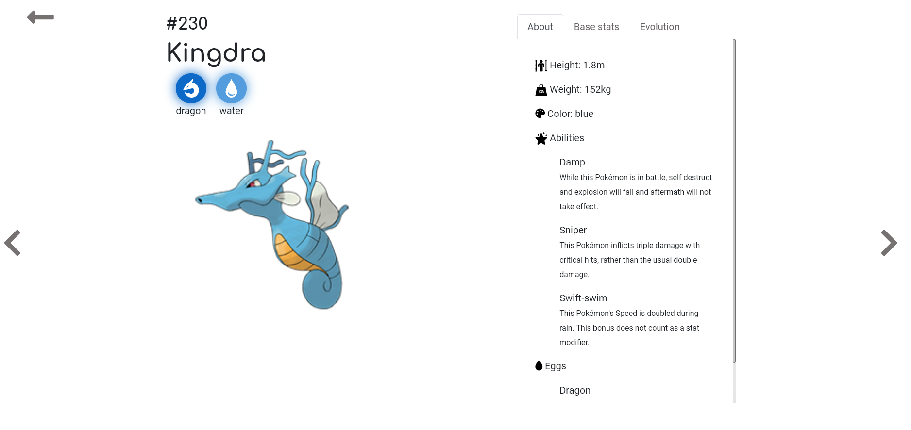

# Pokedex

This project was generated with [Angular CLI](https://github.com/angular/angular-cli) version 8.3.18 and uses data from [PokeAPI](https://pokeapi.co)

## Run project

 `ng serve` or `npm start`

## Description

Regardless of whether you are a big fan of pokemons or just want to find out something about them, it is a perfect place for you. In my Pokedex, you can easily find all the pokemons, you are looking for, and learn plenty of interesting facts about them.

- Pokemons can be filtered by their first letters and by their types. You can apply multiple filters at the same time. If you mark e.g. type dragon and letter D, you will get as a result all pokemons starting with D of type dragon.

- Filtered results or the whole list of pokemons can be sorted in several ways.

- You can search for pokemons by its name or index number.

- In the detailed view, there are basic information, stats, and evolutions of a particular pokemon.
 
 
 
 
 
 
## Built With

-   HTML5
-   SCSS
-   TypeScript
-   Angular 8

## Authors

**Karina Szubert** (https://github.com/Karina-00)

## License

[Mozilla Public License 2.0](https://choosealicense.com/licenses/mpl-2.0/)
